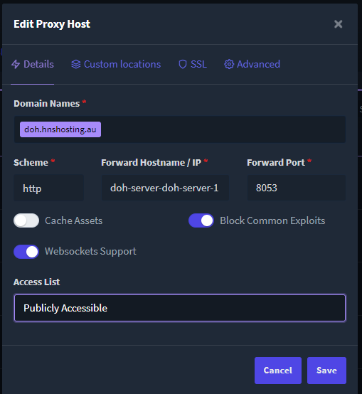

# DoH Server

## Prerequisites
- HSD installed and running
  - HSD DNS resolver enabled and listening  
  You should be able to run `dig @<HSDIP> -p 5350 nathan.woodburn` and get a response with an A record.
- Docker installed and running
- NGINX or another proxy server installed and running
- A ICANN domain that you have access to and that has a valid SSL certificate
  
## Setup
Create a docker compose file with the following contents:
```yaml
version: '3.7'

# Connect to the same network as nginx proxy to allow proxying
# Not required if you are using a proxy that is not running inside docker
networks:
  nginx:
    external: true

services:
  doh-server:
    image: satishweb/doh-server
    hostname: doh-server
    restart: always
    networks:
      - nginx
    ports:
        - "8053:8053" # Not needed if you are using a proxy that is running inside docker
    environment:
      DEBUG: "0"
      UPSTREAM_DNS_SERVER: "udp:10.2.1.15:5350"
      # Replace with 10.2.1.15 with the IP of your HSD server and 5350 with the port you are using for the HSD DNS resolver
      DOH_HTTP_PREFIX: "/dns-query"
      DOH_SERVER_LISTEN: ":8053"
      DOH_SERVER_TIMEOUT: "10"
      DOH_SERVER_TRIES: "3"
      DOH_SERVER_VERBOSE: "true"

```


Setup NGINX to proxy to the docker container.  
For example here is the config I use in NGINX Proxy Manager:  
  

Make sure you have a valid SSL certificate for the domain you are using.


## Test
You can test that it is working by running this command replacing `doh.hnshosting.au` with your domain.

```sh
curl -H 'accept: application/dns-json' 'https://doh.hnshosting.au/dns-query?name=nathan.woodburn&type=A' | jq .
```
