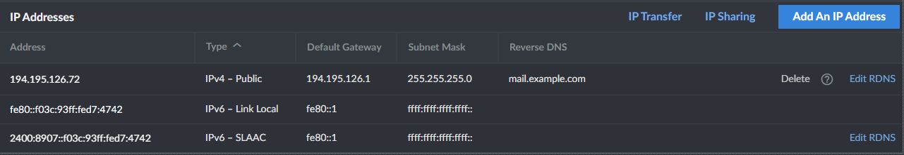

# Email Hosting

## Requirements
- A ICANN second level domain (SLD) eg. `email.com`
- A server with
    - IP address that supports reverse DNS
    - At least 1GB of RAM
    - These ports open
      - 22 (SSH)
      - 25 (SMTP)
      - 53 (DNS for the ICANN domain) both TCP and UDP
      - 80 (HTTP)
      - 443 (HTTPS)
      - 465 (SMTPS)
      - 993 (IMAPS)
      - 995 (POP3S)
      - 4190 (Sieve)


For this guide we will be using
- `example.com` as the ICANN domain
- `exampledomain` as the HNS domain
- `1.2.3.4` as the server IP


## Step 1: Prep server
Change hostname of server to your domain name + sub.
```
sudo echo "mail.example.com" > /etc/hostname
```

Add the hostname to hosts
```
sudo nano /etc/hosts
```
Add the following line to the end of the file
```bash
127.0.0.1   mail.example.com
```

## Step 2: Prep domain
Add two glue records to your ICANN domain
- `ns1.example.com` pointing to `1.2.3.4`
- `ns2.example.com` pointing to `1.2.3.4`
  
Add the following NS records for your ICANN domain
- `ns1.example.com`
- `ns2.example.com`

## Step 3: Install mail in a box
Run the following command to install mail in a box
```bash
curl -s https://mailinabox.email/setup.sh | sudo -E bash
```

Answer the questions and wait for the install to finish.
Run the following command to patch the install to work with HNS

```bash
curl -s https://raw.githubusercontent.com/Nathanwoodburn/HNS-server/main/email/mailinabox.sh | sudo -E bash
```

## Step 4: Add Reverse DNS
Add a reverse DNS record for your server IP pointing to your ICANN domain, in this case `mail.example.com`  
For example like so (but for the IPv6 as well)  


## Step 5: Finish setup
In the admin panel (accessible at `https://mail.example.com/admin`)

Go to the TLS (SSL) Certificates tab and click the "Provision" button (usually requires 2 presses to provision all the certs)

## Adding a domain
Simply add a user with the domain eg. `nathan@woodburn`  
After adding the user, go to external DNS and get the DNS records to add to your DNS for the HNS domain.  
You will need the MX and preferably the SPF records.
